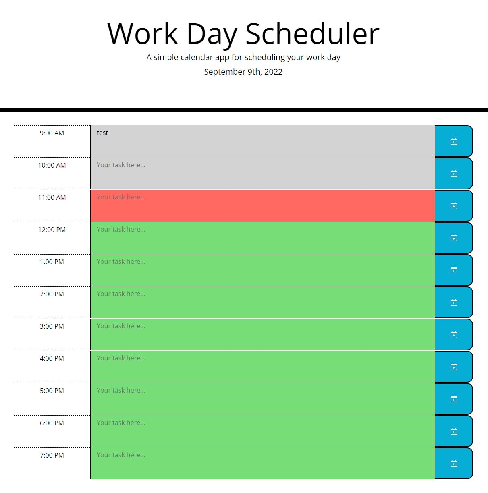

# Module-5 Challenge: Third-Party APIs - Work Day Scheduler

## Description

In order learn more about third-party APIs, I created a simple calendar application based on provided starter code. This app runs in the browser and feature dynamically updated HTML and CSS powered by jQuery and the [Moment.js](https://momentjs.com/) library.

## Installation

N/A

## Usage

Application deployed at the following link: https://park-d.github.io/work-day-scheduler-module5

When a user opens the page, they are presented with a simple hourly calendar for that day. They can add events into the text area in each hourly time block, and save that using the add to calendar button on the right side of each time block. These saved events are available on page refresh.

## Credits

While working on the Module-4 Challenge, I was in a study group with Jackson Myhre and Roy Logan from the same bootcamp class.

Read a lot of documentation from jQuery and stack overflow, but used these mainly to understand logic and utilization of jQuery methods and keywords.
[.each jQuery Documentation](https://api.jquery.com/each/)
[.click jQuery Documentation](https://api.jquery.com/click/)
[.each Stack Overflow responses](https://stackoverflow.com/questions/8524613/using-for-loop-in-jquery)

## License

N/A
